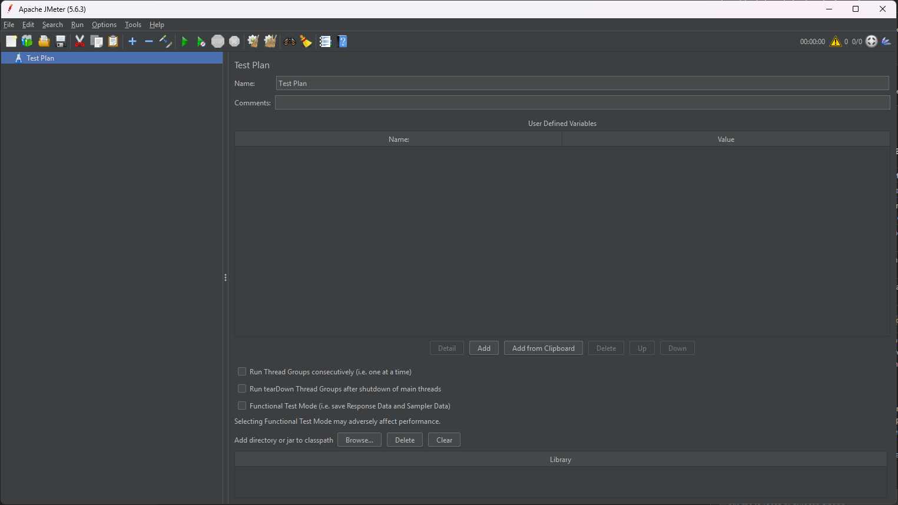

# 1. Install Tools

Before starting performance testing, you need the following tools set up on your machine.


## Required Tools

### Google Chrome

Chrome is needed for both Fiddler proxy setup and the Blazemeter recording extension. Install it first if not already on your machine.

**Download:** [https://www.google.com/chrome/](https://www.google.com/chrome/)

---

### Apache JMeter

JMeter is the core tool for creating and running performance tests.

**Steps:**
1. Install Java JDK 21 (recommended for latest Groovy support and to avoid deprecation issues with plugins)
   - Download from [https://adoptium.net/](https://adoptium.net/) or [https://www.oracle.com/java/technologies/downloads/](https://www.oracle.com/java/technologies/downloads/)
2. Download JMeter from [https://jmeter.apache.org/download_jmeter.cgi](https://jmeter.apache.org/download_jmeter.cgi)
3. Extract the zip file to your preferred location
4. Add JMeter `bin/` folder to your system PATH environment variable
   - This allows you to run `jmeter` from any terminal location
   - Windows: System Properties > Environment Variables > Edit `Path` > Add your JMeter `bin` path (e.g., `C:\apache-jmeter-5.6.3\bin`)
5. Run `jmeter` from terminal or run `jmeter.bat` from the `bin/` folder



**Verify:** JMeter GUI should open with an empty Test Plan as shown above.

---

### Fiddler

Fiddler is used to capture and inspect HTTP/HTTPS traffic. This is essential for correlation work later.

By default, Fiddler captures **all** traffic from your machine, which creates a lot of noise. To only capture traffic from your test flow, we set up Fiddler as a proxy and launch Chrome through that specific port.

**Steps:**
1. Download Fiddler Classic from [https://www.telerik.com/fiddler/fiddler-classic](https://www.telerik.com/fiddler/fiddler-classic)
2. Install and launch Fiddler
3. Enable HTTPS decryption: Tools > Options > HTTPS > Check "Decrypt HTTPS traffic"
4. Fiddler will prompt you to install its root certificate - click **Yes** to trust it (requires admin permission)
   - This is required for Fiddler to decrypt HTTPS traffic
   - Without it, HTTPS requests will show as tunnels and you won't see the actual request/response content
   - If you missed the prompt, go to Tools > Options > HTTPS > click **Actions** > **Trust Root Certificate**
5. Note the proxy port: Tools > Options > Connections (default is `8888`)
6. Launch Chrome using Fiddler's proxy to capture only Chrome traffic:
   ```
   chrome.exe --proxy-server="http=127.0.0.1:8888;https=127.0.0.1:8888"
   ```
   > **Note:** If `chrome.exe` is not in your PATH, use the full path instead:
   > ```
   > "C:\Program Files\Google\Chrome\Application\chrome.exe" --proxy-server="http=127.0.0.1:8888;https=127.0.0.1:8888"
   > ```

<!-- TODO: Screenshot - Fiddler Options showing HTTPS decryption enabled -->
<!-- TODO: Screenshot - Fiddler Connections tab showing port -->
<!-- TODO: Screenshot - Fiddler main window with captured traffic (clean, only Chrome) -->

> **Tip:** Create a shortcut with the proxy flag so you don't have to type it every time.

**Verify:** Open the proxied Chrome, visit any website, and confirm Fiddler captures only that traffic.

---

### Blazemeter Chrome Extension

Blazemeter extension records your browser actions and exports them as a JMeter `.jmx` file.

**Steps:**
1. Open Chrome Web Store and search for "Blazemeter"
2. Install the [BlazeMeter | The Continuous Testing Platform](https://chromewebstore.google.com/detail/blazemeter-the-continuous/mbopgmdnpcbohhpnfglgohlbhfongabi) extension
3. Create a free Blazemeter account (required to export `.jmx` files)
4. Pin the extension to your toolbar for easy access
5. Configure Advanced Options - click the extension icon > **Advanced Options** and make sure:
   - **Record Ajax Requests** is enabled (not enabled by default - we need this to capture page navigations and dynamic content)
   - **Randomize Recorded Think Time** is disabled (we will configure proper timers later in script enhancement)

<!-- TODO: Screenshot - Blazemeter extension in Chrome Web Store -->
<!-- TODO: Screenshot - Blazemeter extension recording panel -->
<!-- TODO: Screenshot - Blazemeter Advanced Options with correct settings -->

**Verify:** Click the extension icon and confirm you see the recording controls with the correct settings.

---

## Optional Tools

These are not required to get started but are useful for advanced workflows.

### Python

Used for test data preparation - generating data, splitting CSV files across machines for distributed testing.

**Steps:**
1. Download Python from [https://www.python.org/downloads/](https://www.python.org/downloads/)
2. During install, check "Add Python to PATH"

**Verify:** Open terminal and run `python --version`

---

### InfluxDB + Grafana

Used for real-time monitoring of JMeter test results via Backend Listener. Covered in detail in [Section 11 - Backend Listener](11-backend-listener.md).

